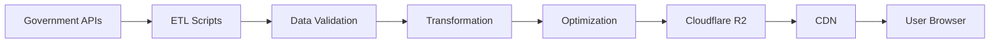

# Where-to-Live-NL: Detailed Development Roadmap

> **Last Updated**: November 2025
> **Project Status**: Planning Phase
> **Target Launch**: Q2 2026 (MVP)

---

## 📋 Table of Contents

1. [Project Vision](#project-vision)
2. [Core Principles](#core-principles)
3. [Development Phases](#development-phases)
4. [Technical Implementation Details](#technical-implementation-details)
5. [Data Integration Strategy](#data-integration-strategy)
6. [Feature Breakdown](#feature-breakdown)
7. [Timeline & Milestones](#timeline--milestones)
8. [Success Metrics](#success-metrics)

---

## 🎯 Project Vision

**Create the most comprehensive, user-friendly housing intelligence platform for expats in the Netherlands by consolidating fragmented government data into actionable insights.**

### Target Audience
- **Primary**: Expats relocating to the Netherlands for work
- **Secondary**: International students, returning Dutch nationals, housing researchers
- **Tertiary**: Real estate professionals, urban planners

### Key Differentiators
1. **Zero web scraping** - 100% legal data from official sources
2. **Near-free hosting** - Sustainable model using modern serverless architecture
3. **Expat-focused** - Built by expats, for expats
4. **Open source** - Transparent, community-driven development

---

## 🧭 Core Principles

### Data Ethics
- ✅ Use only freely available government data
- ✅ Respect Terms of Service (no Funda scraping)
- ✅ GDPR compliant from day one
- ✅ Clear data attribution
- ✅ Privacy-first architecture

### Technical Philosophy
- ✅ Static-first approach (reduce server costs)
- ✅ Progressive enhancement (work without JS)
- ✅ Mobile-first design
- ✅ Accessibility (WCAG 2.1 AA)
- ✅ Performance budget (<3s LCP)

### User Experience
- ✅ Multi-language (English + Dutch minimum)
- ✅ Visual over text-heavy
- ✅ Actionable insights, not raw data
- ✅ Clear warnings about hidden issues
- ✅ No dark patterns or manipulative UI

---

## 🚀 Development Phases

## Phase 0: Foundation (Weeks 1-4)

**Goal**: Set up infrastructure and development environment

### 0.1 Project Setup
- [ ] Initialize Next.js 14 project with TypeScript
- [ ] Configure Tailwind CSS + shadcn/ui components
- [ ] Set up ESLint + Prettier
- [ ] Configure testing framework (Vitest + React Testing Library)
- [ ] Set up GitHub Actions CI/CD pipeline
- [ ] Create development Docker container

### 0.2 Data Infrastructure
- [ ] Set up Cloudflare R2 bucket for data storage
- [ ] Create Cloudflare Worker skeleton for API
- [ ] Design PostgreSQL schema for metadata
- [ ] Set up local development data directory structure
- [ ] Create data versioning strategy (timestamps, checksums)

### 0.3 Documentation
- [ ] Create CONTRIBUTING.md with detailed guidelines
- [ ] Write ATTRIBUTION.md for data sources
- [ ] Draft PRIVACY.md for GDPR compliance
- [ ] Create API documentation structure
- [ ] Set up GitHub wiki for technical docs

**Deliverable**: Working development environment with CI/CD

---

## Phase 1: MVP - Core Data & Interface (Weeks 5-12)

**Goal**: Deliver a functional prototype with essential features

### 1.1 Data Ingestion Pipeline

**🎯 START HERE**: Complete Python ETL scripts available in `scripts/etl/`
- See [scripts/etl/QUICKSTART.md](scripts/etl/QUICKSTART.md) for 5-minute setup
- See [scripts/etl/README.md](scripts/etl/README.md) for detailed documentation

#### BAG (Buildings & Addresses)
```bash
Priority: CRITICAL
Complexity: MEDIUM
Data Source: https://api.pdok.nl/bzk/bag/v2/
Implementation: ✅ scripts/etl/ingest/bag.py
```

**Tasks**:
- [x] Create BAG API client with rate limiting (✅ common/api_client.py)
- [x] Extract address data (all 10M+ addresses) (✅ ingest/bag.py)
- [ ] Extract building data (year built, type, surface area) - Extend bag.py
- [ ] Download energy label data (EPA labels) - Add to bag.py
- [x] Transform to optimized format (JSON → Parquet) (✅ transform/bag_to_parquet.py)
- [x] Create spatial index for fast queries (✅ lat_grid/lon_grid columns)
- [ ] Upload to R2 with CDN configuration

**Available Commands**:
```bash
# Quick test (100 addresses)
python -m ingest.bag --sample 100

# Full download (4-6 hours)
python -m ingest.bag

# Transform to Parquet
python -m transform.bag_to_parquet
```

**Output**:
- `data/processed/bag-addresses.parquet` (~500 MB)
- `data/processed/bag-buildings.parquet` (~800 MB) - TODO
- `data/processed/energy-labels.parquet` (~200 MB) - TODO

#### WOZ Values (Property Valuations)
```bash
Priority: HIGH
Complexity: HIGH (web scraping)
Data Source: https://www.wozwaardeloket.nl/
Implementation: ✅ scripts/etl/ingest/woz.py
```

**Tasks**:
- [x] Create WOZ scraper with rate limiting (✅ ingest/woz.py)
- [x] Implement checkpoint/resume functionality (✅ Built-in)
- [ ] Priority-based scraping (popular postal codes first)
- [ ] Integrate with user search (on-demand scraping)
- [ ] Community caching model (share scraped data)

**Available Commands**:
```bash
# Test with 10 addresses (~10 seconds)
python -m ingest.woz --sample 10

# Full scraping (⚠️ 92 days at 1 req/sec!)
python -m ingest.woz

# Resume interrupted scraping
python -m ingest.woz --resume
```

**Legal Note**: Individual WOZ lookups are allowed. We implement 1 req/sec rate limiting to be respectful.

**Output**:
- `data/processed/woz-values.parquet` (~150 MB)

#### CBS Demographics
```bash
Priority: HIGH
Complexity: LOW
Data Source: https://opendata.cbs.nl/
```

**Tasks**:
- [ ] Download neighborhood (buurt) boundary data
- [ ] Extract demographic statistics (age, household size, income)
- [ ] Download migration statistics
- [ ] Transform to normalized tables
- [ ] Create lookup indexes by postal code

**Output**:
- `data/processed/cbs-demographics.json` (~50 MB)
- `data/processed/cbs-boundaries.geojson` (~100 MB)

#### Leefbaarometer (Livability)
```bash
Priority: HIGH
Complexity: LOW
Data Source: https://www.leefbaarometer.nl/
```

**Tasks**:
- [ ] Download 2022 livability scores (100x100m grid)
- [ ] Extract subcategory scores (facilities, safety, physical environment)
- [ ] Create raster tiles for map visualization
- [ ] Generate summary statistics by neighborhood

**Output**:
- `data/processed/leefbaarometer-scores.geojson` (~300 MB)
- `data/tiles/leefbaarometer/{z}/{x}/{y}.pbf` (~200 MB total)

#### Crime Statistics
```bash
Priority: MEDIUM
Complexity: LOW
Data Source: https://data.politie.nl/
```

**Tasks**:
- [ ] Download burglary data by neighborhood
- [ ] Download attempted burglary data
- [ ] Calculate crime density per 1000 residents
- [ ] Create 3-year trend analysis
- [ ] Generate safety score (0-10)

**Output**:
- `data/processed/crime-statistics.json` (~50 MB)

### 1.2 Map Interface

**Goal**: 100% free, no vendor lock-in, unlimited usage
**See**: [MAPPING.md](MAPPING.md) for complete implementation guide

**Tasks**:
- [ ] Set up MapLibre GL JS (free, no API key required)
- [ ] Add PDOK BRT base map (Dutch government tiles - free, unlimited)
  - Style options: Standaard, Grijs, Pastel
  - Vector tiles: `https://api.pdok.nl/brt/achtergrondkaart/ogc/v1_0/tiles/`
  - Raster tiles: `https://service.pdok.nl/brt/achtergrondkaart/wmts/v2_0/`
- [ ] Implement address search using PDOK Locatieserver (free geocoding API)
- [ ] Add municipality/neighborhood boundaries from PDOK WFS
- [ ] Create heatmap visualization for livability scores
- [ ] Implement click-to-view property details
- [ ] Add zoom/pan controls, geolocation, scale bar
- [ ] Mobile-responsive map interactions
- [ ] Add layer toggle controls (livability, crime, schools)

**Technical Stack**:
- **MapLibre GL JS v3** (BSD license, fork of Mapbox GL)
- **PDOK Vector Tiles** (CC0, Dutch government)
- **PDOK Geocoding API** (free, no rate limits)
- Custom styling based on Dutch cartographic standards

**Why This Stack?**
- ✅ Zero cost (no API keys, no usage limits)
- ✅ No vendor lock-in (100% open source)
- ✅ Commercial-safe (CC0 license)
- ✅ Self-hostable if needed
- ✅ Government-backed reliability (99.9%+ uptime)

### 1.3 Property Detail View

**Tasks**:
- [ ] Create property information card component
- [ ] Display BAG building data (year, type, size)
- [ ] Show energy label with explanation
- [ ] Display livability score with breakdown
- [ ] Show crime statistics for neighborhood
- [ ] Add demographic snapshot (age, household types)
- [ ] Create "Red Flags" section (erfpacht, foundation risk)
- [ ] Add "Share this location" functionality

**UI Components**:
```typescript
<PropertyCard>
  <AddressHeader />
  <QuickStats />
  <LivabilityScore />
  <SafetyMetrics />
  <BuildingDetails />
  <RedFlagsAlert />
  <NeighborhoodSnapshot />
  <ShareButton />
</PropertyCard>
```

### 1.4 Basic Search & Filtering

**Tasks**:
- [ ] Implement address autocomplete (fuzzy matching)
- [ ] Add postal code search
- [ ] Create city/municipality selector
- [ ] Add price range filter (user input, no Funda data)
- [ ] Add property type filter (house, apartment, etc.)
- [ ] Add construction year filter
- [ ] Save search preferences to localStorage

**Deliverable**: Working MVP accessible at https://where-to-live-nl.vercel.app

---

## Phase 2: Enhanced Analysis Tools (Weeks 13-20)

**Goal**: Add intelligence and comparison features

### 2.1 Travel Time Calculator (MapitOut Clone)

**Tasks**:
- [ ] Integrate TravelTime API (or build custom algorithm)
- [ ] Add "Add Destination" interface (work, school, etc.)
- [ ] Calculate cycling isochrones (10, 20, 30 min)
- [ ] Calculate public transport isochrones (with 10min bike access)
- [ ] Visualize intersection areas (where all criteria overlap)
- [ ] Add NS train station data
- [ ] Include GVB metro/tram stops (Amsterdam area)
- [ ] Create saved travel time configurations

**Algorithm Design**:
```javascript
// Simplified logic
function calculateReachableAreas(destinations) {
  const isochrones = destinations.map(dest => {
    return generateIsochrone({
      point: dest.location,
      maxTime: dest.maxMinutes,
      modes: ['cycling', 'pt'] // public transport
    });
  });

  // Find intersection of all isochrones
  return intersectPolygons(isochrones);
}
```

**Data Requirements**:
- OpenStreetMap road network (extracted for NL)
- NS train timetables (via GTFS)
- Bus/tram routes (via 9292 GTFS export)

### 2.2 Environmental Layers

#### Atlas Leefomgeving Integration
**Tasks**:
- [ ] Add air quality layer (NO2, PM10, PM2.5)
- [ ] Add noise pollution layer (road, rail, industrial)
- [ ] Add flood risk layer (from Waterschappen)
- [ ] Add soil contamination sites
- [ ] Add green space proximity
- [ ] Create environmental score (0-10)
- [ ] Add toggle switches for each layer

#### KNMI Climate Data
**Tasks**:
- [ ] Add average sunshine hours by region
- [ ] Add precipitation data
- [ ] Add wind exposure
- [ ] Create "climate comfort" score

### 2.3 Schools & Family Amenities

**Tasks**:
- [ ] Import DUO school location data
- [ ] Categorize schools (primary, secondary, international)
- [ ] Add school quality indicators (inspection scores)
- [ ] Calculate distance to nearest schools (by bike)
- [ ] Add daycare/kindergarten locations
- [ ] Add playground locations (from OpenStreetMap)
- [ ] Create "family friendliness" score

### 2.4 Neighborhood Comparison Tool

**Tasks**:
- [ ] Create side-by-side comparison view (up to 3 areas)
- [ ] Compare livability scores
- [ ] Compare safety metrics
- [ ] Compare demographics
- [ ] Compare average property prices (user-submitted)
- [ ] Compare environmental factors
- [ ] Export comparison as PDF report

**UI Mockup**:
```
┌─────────────┬─────────────┬─────────────┐
│  Amsterdam  │  Utrecht    │  Rotterdam  │
│    Oost     │   Centrum   │    Noord    │
├─────────────┼─────────────┼─────────────┤
│ Livability: │ Livability: │ Livability: │
│    8.2/10   │    7.9/10   │    7.5/10   │
├─────────────┼─────────────┼─────────────┤
│   Safety:   │   Safety:   │   Safety:   │
│    7.5/10   │    8.1/10   │    6.9/10   │
└─────────────┴─────────────┴─────────────┘
```

### 2.5 Foundation Risk Database (MVP)

**Tasks**:
- [ ] Research areas with known wooden pile problems
- [ ] Create database of at-risk zones (pre-1970 construction)
- [ ] Add Amsterdam foundation replacement areas
- [ ] Include Haarlem, Rotterdam, Gouda at-risk zones
- [ ] Create visual overlay on map
- [ ] Add explanation of foundation issues (in English)
- [ ] Link to municipal foundation inspection programs

**Initial Data Sources**:
- Municipal reports (publicly available)
- Historical construction data (BAG year built)
- Heuristic: pre-1970 + below sea level + near water = HIGH RISK

**Deliverable**: Enhanced platform with travel time calc and environmental data

---

## Phase 3: Premium Features & Monetization (Weeks 21-30)

**Goal**: Add paid features and sustainability

### 3.1 User Accounts & Saved Searches

**Tasks**:
- [ ] Set up authentication (Clerk or Auth.js)
- [ ] Create user profile page
- [ ] Add "Save this location" functionality
- [ ] Add "Save this search" for travel time configs
- [ ] Email notifications for saved searches (optional)
- [ ] Export saved locations as CSV
- [ ] User dashboard with saved data

**Tech Stack**:
- Clerk (free tier: 5k users) or Auth.js (self-hosted)
- Supabase for user data storage

### 3.2 WOZ Value Integration

**Approach**:
Since bulk WOZ data isn't freely available, use caching strategy:

**Tasks**:
- [ ] Create WOZ lookup tool (users query one address at time)
- [ ] Scrape WOZ Waardeloket for individual addresses (respecting rate limits)
- [ ] Cache WOZ values for 6 months
- [ ] Create "community unlocked" model (once queried, all can see)
- [ ] Compare WOZ to user-submitted asking prices
- [ ] Create "value anomaly" alerts (price >> WOZ)

**Legal Considerations**:
- WOZ values are public information (no privacy issues)
- Individual queries allowed, bulk scraping discouraged
- Cache data to reduce load on government servers

### 3.3 Kadaster Data Integration (Paid Feature)

**Tasks**:
- [ ] Set up Kadaster API account (paid)
- [ ] Implement transaction history lookup
- [ ] Show last 5 sales for an address
- [ ] Calculate price appreciation trends
- [ ] Identify erfpacht properties from Kadaster records
- [ ] Show cadastral boundaries (lot sizes)
- [ ] Create premium tier ($5/month for unlimited queries)

**Pricing Model**:
- Kadaster API: ~€0.50 per query
- User pays €5/month = 10 queries included
- Additional queries: €1 each
- Or: Community pool (users share cost)

### 3.4 Predictive Pricing Model (Experimental)

**Tasks**:
- [ ] Collect user-submitted asking prices (crowdsourced)
- [ ] Train ML model on Kadaster transaction data (if accessible)
- [ ] Input features: size, year, location, livability, energy label
- [ ] Predict fair market value for any address
- [ ] Show confidence interval
- [ ] Compare to WOZ and user-submitted prices

**Tech Stack**:
- Python (scikit-learn or TensorFlow.js)
- Run inference in browser or Cloudflare Worker

### 3.5 Erfpacht Calculator

**Tasks**:
- [ ] Create erfpacht explainer (what is it?)
- [ ] Calculate annual ground lease payments
- [ ] Show buy-out options (if applicable)
- [ ] Identify perpetual vs. expiring leases
- [ ] Create "erfpacht vs. eigendom" comparison tool
- [ ] Add municipality-specific rules (Amsterdam vs. Utrecht)

**Deliverable**: Premium features with subscription model

---

## Phase 4: Community & Intelligence (Weeks 31-40)

**Goal**: Crowdsource local knowledge and build community

### 4.1 User Reviews & Local Insights

**Tasks**:
- [ ] Add "Living here" reviews (by residents)
- [ ] Moderate reviews for quality and authenticity
- [ ] Add "Pros & Cons" structure (not free-form text)
- [ ] Vote on helpful reviews (Reddit-style)
- [ ] Tag reviews (noise, parking, expat-friendly, etc.)
- [ ] Show verified resident badge (optional email verification)

**Review Structure**:
```json
{
  "neighborhood": "Amsterdam Oost",
  "resided": "2020-2023",
  "pros": ["Great parks", "Diverse community", "Good transit"],
  "cons": ["Limited parking", "Busy on weekends"],
  "tags": ["family-friendly", "expat-friendly"],
  "wouldRecommend": true,
  "helpfulVotes": 47
}
```

### 4.2 Foundation Problems Crowdsourcing

**Tasks**:
- [ ] Add "Report foundation issue" button
- [ ] Collect address, issue type, repair cost (optional)
- [ ] Verify submissions (require photo evidence)
- [ ] Create foundation risk heatmap from submissions
- [ ] Partner with foundation inspection companies for data
- [ ] Show repair cost estimates by area

**Gamification**:
- Users who submit 5+ verified reports get "Foundation Expert" badge
- Show leaderboard of top contributors

### 4.3 Expat Resources Hub

**Tasks**:
- [ ] Create "Moving to NL" guides by city
- [ ] Add BSN registration locations
- [ ] Add housing registration (inschrijven) info
- [ ] Link to rental protection resources (Huurcommissie)
- [ ] Create expat-friendly service directory (movers, insurance, etc.)
- [ ] Add "Ask the community" forum

### 4.4 Mobile App (React Native)

**Tasks**:
- [ ] Set up React Native project (Expo)
- [ ] Port map interface to mobile
- [ ] Add location-based search ("Find near me")
- [ ] Implement push notifications (saved search alerts)
- [ ] Add offline mode (cached searches)
- [ ] Publish to iOS App Store & Google Play

**Deliverable**: Community-driven platform with mobile app

---

## Phase 5: Polish & Scale (Weeks 41-52)

**Goal**: Production-ready, scalable platform

### 5.1 Performance Optimization

**Tasks**:
- [ ] Implement aggressive caching (CDN + browser)
- [ ] Lazy load map tiles and data
- [ ] Use Intersection Observer for image loading
- [ ] Optimize bundle size (tree shaking, code splitting)
- [ ] Achieve Lighthouse score >90 (all metrics)
- [ ] Add service worker for offline functionality
- [ ] Implement skeleton screens for loading states

**Performance Budget**:
- LCP (Largest Contentful Paint): <2.5s
- FID (First Input Delay): <100ms
- CLS (Cumulative Layout Shift): <0.1
- Bundle size: <200 KB (gzipped)

### 5.2 Accessibility & Internationalization

**Tasks**:
- [ ] Full keyboard navigation
- [ ] ARIA labels for screen readers
- [ ] High contrast mode
- [ ] Multilingual support (EN, NL, ES, FR, DE)
- [ ] RTL support for Arabic (future consideration)
- [ ] Add language switcher
- [ ] Translate all government data labels

### 5.3 SEO & Content Marketing

**Tasks**:
- [ ] Generate static pages for top 50 cities
- [ ] Create neighborhood guides (Amsterdam Oost, Utrecht Centrum, etc.)
- [ ] Write blog posts (e.g., "Understanding Erfpacht", "Avoiding Foundation Issues")
- [ ] Add structured data (Schema.org markup)
- [ ] Submit to Google Search Console
- [ ] Create social media preview cards (Open Graph)
- [ ] Build backlinks from expat forums

### 5.4 Analytics & Monitoring

**Tasks**:
- [ ] Set up privacy-friendly analytics (Plausible or Umami)
- [ ] Track user journeys (search → view → save)
- [ ] Monitor API error rates
- [ ] Set up uptime monitoring (Better Uptime)
- [ ] Create internal dashboard (metrics, costs, usage)
- [ ] Add user feedback widget
- [ ] Implement A/B testing framework

### 5.5 Legal & Compliance

**Tasks**:
- [ ] Create Terms of Service
- [ ] Write Privacy Policy (GDPR compliant)
- [ ] Add cookie consent banner (if needed)
- [ ] Set up GDPR data export/deletion
- [ ] Register with Dutch data protection authority (if required)
- [ ] Add DMCA/content moderation process
- [ ] Create incident response plan

**Deliverable**: Production-ready platform at v1.0

---

## 📊 Technical Implementation Details

### Data Pipeline Architecture



### ETL Scripts Structure

```bash
scripts/etl/
├── common/
│   ├── api-client.ts        # Reusable HTTP client with retries
│   ├── data-validator.ts    # JSON schema validation
│   ├── geo-utils.ts         # Spatial operations
│   └── logger.ts            # Structured logging
├── sources/
│   ├── bag/
│   │   ├── download.ts      # Fetch BAG data
│   │   ├── transform.ts     # Clean and normalize
│   │   ├── index.ts         # Create spatial index
│   │   └── validate.ts      # Data quality checks
│   ├── cbs/
│   ├── leefbaarometer/
│   ├── crime/
│   └── schools/
└── pipelines/
    ├── daily.ts             # Update frequently-changing data
    ├── weekly.ts            # Update weekly data
    ├── monthly.ts           # Full refresh
    └── upload-to-r2.ts      # Deploy to production
```

### Data Processing Steps

#### 1. Download
```typescript
// scripts/etl/sources/bag/download.ts
import { PDOK_BAG_API } from '@/config';

async function downloadBAGData() {
  const response = await fetch(PDOK_BAG_API + '/adressen');
  const data = await response.json();

  // Save raw data
  await writeFile('data/raw/bag-addresses.json', JSON.stringify(data));

  logger.info(`Downloaded ${data.length} addresses`);
}
```

#### 2. Transform
```typescript
// scripts/etl/sources/bag/transform.ts
function transformAddress(raw: RawBAGAddress) {
  return {
    id: raw.identificatie,
    street: raw.openbareRuimteNaam,
    houseNumber: raw.huisnummer,
    postalCode: raw.postcode,
    city: raw.woonplaatsNaam,
    location: {
      type: 'Point',
      coordinates: [raw.lon, raw.lat]
    },
    buildYear: raw.bouwjaar,
    surfaceArea: raw.oppervlakte,
    energyLabel: raw.energielabel
  };
}
```

#### 3. Optimize
```typescript
// Convert to Parquet for 40% size reduction (better than JSON!)
// Parquet = columnar format, compressed, queryable
import { writeParquet } from 'parquet-wasm';

const addresses = await readJSON('data/processed/bag-addresses.json');
const parquetBuffer = await writeParquet(addresses, {
  compression: 'SNAPPY', // Fast compression
  schema: {
    id: { type: 'UTF8' },
    postalCode: { type: 'UTF8' },
    buildYear: { type: 'INT32' },
    // ... define all columns
  }
});

await writeFile('data/processed/bag-addresses.parquet', parquetBuffer);

// Result: JSON 2.5 GB → Parquet 500 MB (80% reduction!)
```

### API Layer (Cloudflare Workers)

```typescript
// workers/api/property.ts
export default {
  async fetch(request: Request, env: Env) {
    const url = new URL(request.url);
    const address = url.searchParams.get('address');

    // Fetch from R2 bucket
    const bagData = await env.R2_BUCKET.get('bag-addresses.parquet');
    const parquet = await bagData.arrayBuffer();

    // Query Parquet file (DuckDB WASM)
    const result = await queryParquet(parquet, {
      filter: { street: address }
    });

    return new Response(JSON.stringify(result), {
      headers: { 'Content-Type': 'application/json' }
    });
  }
}
```

### Frontend Architecture

```typescript
// src/app/page.tsx
import { MapView } from '@/components/map/MapView';
import { SearchBar } from '@/components/search/SearchBar';
import { PropertyDetails } from '@/components/property/PropertyDetails';

export default function HomePage() {
  const [selectedAddress, setSelectedAddress] = useState(null);

  return (
    <div className="grid grid-cols-[1fr_400px]">
      <MapView
        onAddressClick={setSelectedAddress}
      />
      <aside>
        <SearchBar />
        {selectedAddress && (
          <PropertyDetails address={selectedAddress} />
        )}
      </aside>
    </div>
  );
}
```

---

## 🗂️ Data Integration Strategy

### Data Update Frequencies

| Data Source | Update Frequency | Processing Time | Size |
|-------------|------------------|-----------------|------|
| BAG | Quarterly | 2-3 hours | 1.5 GB |
| CBS Demographics | Annually | 30 min | 100 MB |
| Leefbaarometer | Annually | 1 hour | 500 MB |
| Crime Stats | Quarterly | 20 min | 50 MB |
| Schools | Annually | 10 min | 20 MB |
| Environmental | Annually | 2 hours | 2 GB |
| **Total** | - | **~6 hours** | **~4 GB** |

### Automated Pipeline (GitHub Actions)

```yaml
# .github/workflows/data-pipeline.yml
name: Data Pipeline

on:
  schedule:
    - cron: '0 2 * * 0'  # Every Sunday at 2 AM
  workflow_dispatch:      # Manual trigger

jobs:
  update-data:
    runs-on: ubuntu-latest
    steps:
      - uses: actions/checkout@v3

      - name: Install dependencies
        run: npm install

      - name: Download BAG data
        run: npm run etl:bag:download

      - name: Process BAG data
        run: npm run etl:bag:transform

      - name: Upload to R2
        run: npm run etl:upload
        env:
          R2_ACCESS_KEY: ${{ secrets.R2_ACCESS_KEY }}
          R2_SECRET_KEY: ${{ secrets.R2_SECRET_KEY }}
```

---

## 📅 Timeline & Milestones

```
Q4 2025 (Nov-Dec)
├─ Week 1-2:   Phase 0 complete (foundation)
├─ Week 3-4:   Initial data pipeline (BAG)
└─ Week 5-6:   Map interface prototype

Q1 2026 (Jan-Mar)
├─ Week 7-9:   Complete MVP data sources
├─ Week 10-12: Property detail view
├─ Week 13:    Internal alpha testing
└─ Week 14:    MVP soft launch (friends & family)

Q2 2026 (Apr-Jun)
├─ Week 15-18: Phase 2 features (travel time)
├─ Week 19-20: Environmental layers
├─ Week 21-22: Public beta launch
└─ Week 23-24: Marketing & user feedback

Q3 2026 (Jul-Sep)
├─ Week 25-28: Premium features
├─ Week 29-32: Community features
├─ Week 33-36: Mobile app development
└─ Week 37:    v1.0 production launch

Q4 2026 (Oct-Dec)
├─ Week 38-40: Scale & optimize
├─ Week 41-44: Marketing & growth
├─ Week 45-48: International expansion (Belgium?)
└─ Week 49-52: Year-end review & 2027 planning
```

### Key Milestones

| Milestone | Target Date | Success Criteria |
|-----------|-------------|------------------|
| **Alpha Launch** | Week 14 (Jan 2026) | 50 users, <10 critical bugs |
| **Beta Launch** | Week 22 (May 2026) | 500 users, positive feedback |
| **v1.0 Launch** | Week 37 (Sep 2026) | 5,000 users, $100 MRR |
| **Break-even** | Week 52 (Dec 2026) | Revenue ≥ hosting costs |
| **Sustainability** | Q2 2027 | 10,000 users, $500 MRR |

---

## 📈 Success Metrics

### User Metrics (Monthly)
- Active users: 10,000 by end of Year 1
- Retention rate: >40% (30-day)
- Average session time: >5 minutes
- Searches per user: >3
- Conversion to saved locations: >30%

### Technical Metrics
- Uptime: >99.5%
- API response time: <500ms (p95)
- Lighthouse score: >90
- Zero data breaches
- CDN cache hit rate: >80%

### Business Metrics
- Monthly hosting cost: <$50
- Premium conversion rate: >2%
- Monthly Recurring Revenue: $500 by Q4 2026
- Community contributions: >100 reviews/month
- Press mentions: >5 by end of Year 1

### Impact Metrics
- Users who avoided bad neighborhoods: [survey]
- Users who saved money (price vs WOZ): [survey]
- Users who found family-friendly areas: [survey]
- Average user satisfaction: >4.5/5

---

## 🎯 Launch Checklist

### Pre-Launch (Week 36)
- [ ] All Phase 1 & 2 features complete
- [ ] Security audit passed
- [ ] Performance budget met
- [ ] GDPR compliance verified
- [ ] Legal documents reviewed
- [ ] Error monitoring configured
- [ ] Backup strategy tested

### Launch Day (Week 37)
- [ ] Deploy to production
- [ ] Submit to ProductHunt
- [ ] Post to r/Netherlands, r/Amsterdam
- [ ] Email beta users
- [ ] Monitor error logs
- [ ] Prepare hotfix process

### Post-Launch (Week 38-40)
- [ ] Daily monitoring first week
- [ ] Respond to all user feedback
- [ ] Fix critical bugs <24h
- [ ] Collect testimonials
- [ ] Write launch retrospective

---

## 🔮 Future Vision (2027+)

### Potential Expansions
1. **Belgium integration** (similar data structure)
2. **Germany expansion** (larger market)
3. **B2B offering** (for relocation companies)
4. **White-label solution** (municipalities, employers)
5. **API marketplace** (sell processed data access)

### Advanced Features
- AI chatbot ("Find me a neighborhood like X but cheaper")
- Predictive alerts ("This area is gentrifying")
- Integration with rental platforms (Pararius API?)
- Virtual neighborhood tours (Street View integration)
- Comparison with other EU cities

---

## 📝 Open Questions & Decisions Needed

### Technical
- [ ] MapLibre vs. Mapbox (licensing)?
  - **Recommendation**: MapLibre + PDOK (free, no API key)
- [ ] Supabase vs. PlanetScale for user data?
  - **Recommendation**: Supabase (PostGIS built-in, better free tier)
- [ ] Self-host vs. Clerk for auth?
  - **Recommendation**: Start with Supabase Auth (free), migrate to Clerk if needed
- [ ] DuckDB WASM vs. server-side queries?
  - **Recommendation**: DuckDB WASM in Cloudflare Workers (query Parquet files)
- [ ] JSON vs. Parquet vs. PostgreSQL for data storage?
  - **Government data**: Parquet on R2 (large, read-heavy)
  - **User data**: PostgreSQL/PostGIS (relational, writes)
  - **Config**: JSON (small, human-readable)

### Business
- [ ] Premium pricing: $5, $10, or $15/month?
- [ ] Freemium vs. fully free with donations?
- [ ] Ads or sponsorships (estate agents)?
- [ ] Kadaster cost-sharing model details?

### Legal
- [ ] Need a business entity (BV)?
- [ ] GDPR representative required?
- [ ] Insurance needed (E&O)?
- [ ] Trademark "Where-to-Live-NL"?

---

## 🤝 How to Contribute to This Roadmap

This roadmap is a living document. To propose changes:

1. Open a GitHub Discussion in the "Roadmap" category
2. Submit a PR with proposed changes to ROADMAP.md
3. Tag with `roadmap-feedback` label
4. Get community input before merging

**Roadmap Review Frequency**: Monthly (first Monday of month)

---

**Document Version**: 1.0
**Last Updated**: November 3, 2025
**Next Review**: December 1, 2025
**Owner**: @yourusername
**Contributors**: Community

---

*This roadmap represents our current best thinking but will evolve based on user feedback, technical constraints, and available resources. Dates are targets, not commitments.*
