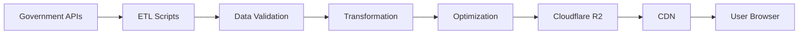

# Where-to-Live-NL: Detailed Development Roadmap

> **Last Updated**: December 2025
> **Project Status**: MVP Complete - Phase 2 In Progress
> **Target Launch**: Q1 2026 (Public Beta)

  To test, you need to:
  1. Start the backend: cd backend && python api_server.py
  2. Start the frontend: cd frontend && npm run dev

---

## 📋 Table of Contents

1. [Project Vision](#project-vision)
2. [Core Principles](#core-principles)
3. [Development Phases](#development-phases)
4. [Technical Implementation Details](#technical-implementation-details)
5. [Data Integration Strategy](#data-integration-strategy)
6. [Feature Breakdown](#feature-breakdown)
7. [Timeline & Milestones](#timeline--milestones)
8. [Success Metrics](#success-metrics)

---

## 🎯 Project Vision

**Create the most comprehensive, user-friendly housing intelligence platform for expats in the Netherlands by consolidating fragmented government data into actionable insights.**

### Target Audience
- **Primary**: Expats relocating to the Netherlands for work
- **Secondary**: International students, returning Dutch nationals, housing researchers
- **Tertiary**: Real estate professionals, urban planners

### Key Differentiators
1. **Zero web scraping** - 100% legal data from official sources
2. **Near-free hosting** - Sustainable model using modern serverless architecture
3. **Expat-focused** - Built by expats, for expats
4. **Open source** - Transparent, community-driven development

---

## 🧭 Core Principles

### Data Ethics
- ✅ Use only freely available government data
- ✅ Respect Terms of Service (no Funda scraping)
- ✅ GDPR compliant from day one
- ✅ Clear data attribution
- ✅ Privacy-first architecture

### Technical Philosophy
- ✅ Static-first approach (reduce server costs)
- ✅ Progressive enhancement (work without JS)
- ✅ Mobile-first design
- ✅ Accessibility (WCAG 2.1 AA)
- ✅ Performance budget (<3s LCP)

### User Experience
- ✅ Multi-language (English + Dutch minimum)
- ✅ Visual over text-heavy
- ✅ Actionable insights, not raw data
- ✅ Clear warnings about hidden issues
- ✅ No dark patterns or manipulative UI

---

## 🚀 Development Phases

## Phase 0: Foundation ✅ COMPLETE

**Goal**: Set up infrastructure and development environment

### 0.1 Project Setup
- [x] Initialize Next.js 14 project with TypeScript
- [x] Configure Tailwind CSS + shadcn/ui components
- [x] Set up ESLint + Prettier
- [x] Set up local development environment
- [x] Create Python backend API server

### 0.2 Data Infrastructure
- [x] Set up local data directory structure (data/raw, data/processed)
- [x] Create ETL pipeline with Python scripts
- [x] Implement Parquet data format for efficient storage
- [ ] Set up Cloudflare R2 bucket for production storage
- [ ] Create Cloudflare Worker skeleton for API

### 0.3 Documentation
- [x] Create comprehensive README.md
- [x] Write GETTING_STARTED.md guide
- [x] Create ETL QUICKSTART.md
- [x] Document data sources in DATA_SOURCES_SUMMARY.md
- [ ] Create CONTRIBUTING.md with detailed guidelines
- [ ] Write ATTRIBUTION.md for data sources

**Deliverable**: ✅ Working development environment

---

## Phase 1: MVP - Core Data & Interface ✅ COMPLETE

**Goal**: Deliver a functional prototype with essential features

### 1.1 Data Ingestion Pipeline ✅ COMPLETE

**Complete Python ETL scripts available in `scripts/etl/`**
- See [scripts/etl/QUICKSTART.md](scripts/etl/QUICKSTART.md) for 5-minute setup
- See [scripts/etl/README.md](scripts/etl/README.md) for detailed documentation

#### BAG (Buildings & Addresses) ✅
- [x] Create BAG API client with rate limiting (✅ common/api_client.py)
- [x] Extract address data (all 10M+ addresses) (✅ ingest/bag.py)
- [x] Transform to optimized format (JSON → Parquet) (✅ transform/bag_to_parquet.py)
- [x] Create spatial index for fast queries (✅ lat_grid/lon_grid columns)
- [ ] Upload to R2 with CDN configuration (pending deployment)

#### WOZ Values (Property Valuations) ✅
- [x] Create WOZ scraper with rate limiting (✅ ingest/woz.py)
- [x] Implement checkpoint/resume functionality (✅ Built-in)
- [ ] Community caching model (future enhancement)

#### CBS Demographics ✅
- [x] Download neighborhood (buurt) boundary data (✅ ingest/cbs_demographics.py)
- [x] Extract demographic statistics (age, household size, income)
- [x] Transform to Parquet (✅ transform/cbs_demographics_to_parquet.py)
- [x] Create proximity data (✅ ingest/cbs_proximity.py)

#### Leefbaarometer (Livability) ✅
- [x] Download livability scores (✅ ingest/leefbaarometer.py)
- [x] Transform to Parquet (✅ transform/leefbaarometer_to_parquet.py)
- [x] Integrate with map overlay

#### Crime Statistics ✅
- [x] Download crime data (✅ ingest/crime.py)
- [x] Transform to Parquet (✅ transform/crime_to_parquet.py)
- [x] Create map overlay with crime statistics

### 1.2 Map Interface ✅ COMPLETE

**Goal**: 100% free, no vendor lock-in, unlimited usage

**Implemented Features**:
- [x] MapLibre GL JS with PDOK BRT base map (Dutch government tiles)
- [x] Address autocomplete using PDOK Locatieserver (free geocoding API)
- [x] Layer toggle controls for all data overlays
- [x] Zoom/pan controls and geolocation
- [x] Mobile-responsive map interactions
- [x] Click-to-view property/amenity details

**Active Map Layers**:
- [x] Livability scores (Leefbaarometer) overlay
- [x] Crime statistics overlay
- [x] Air quality overlay (NO2, PM10, PM2.5)
- [x] Foundation risk overlay
- [x] Flood risk overlay
- [x] Schools layer (15,269 schools)
- [x] Supermarkets layer (6,049 stores)
- [x] Healthcare facilities layer
- [x] Train stations layer
- [x] Playgrounds layer

**Technical Stack**:
- **MapLibre GL JS** (BSD license, fork of Mapbox GL)
- **PDOK Raster Tiles** (CC0, Dutch government)
- **PDOK Locatieserver** (free geocoding API)
- **OpenRouteService** (travel time isochrones)

### 1.3 Property Detail View ✅ COMPLETE

**Implemented Features**:
- [x] Property information display with BAG data
- [x] Energy label display
- [x] Livability score with breakdown
- [x] Crime statistics for neighborhood
- [x] Air quality information panel (AirQualityInfo.tsx)
- [x] Foundation risk warnings
- [x] Flood risk information

### 1.4 Basic Search & Filtering ✅ COMPLETE

**Implemented Features**:
- [x] Address autocomplete with PDOK Locatieserver (AddressAutocomplete.tsx)
- [x] Property filters panel (PropertyFilters.tsx)
  - Price range filter
  - Property type filter
  - Construction year filter
- [x] Travel time calculator with multiple destinations
- [x] Isochrone visualization (cycling, public transport)

**Deliverable**: ✅ Working MVP at localhost:3000

---

## Phase 2: Enhanced Analysis Tools (IN PROGRESS)

**Goal**: Add intelligence and comparison features

### 2.1 Travel Time Calculator ✅ COMPLETE

**Implemented Features**:
- [x] OpenRouteService integration for isochrone calculation
- [x] "Add Destination" interface (work, school, etc.)
- [x] Cycling isochrones (10, 20, 30+ min)
- [x] Public transport isochrones
- [x] Visualize intersection areas on map
- [x] NS train station data layer (ingest/ns_stations.py)
- [x] Multiple transport modes support

### 2.2 Environmental Layers ✅ COMPLETE

**Implemented Features**:
- [x] Air quality layer (NO2, PM10, PM2.5) - ingest/air_quality.py
- [x] Flood risk layer (ingest/flood_risk.py)
- [x] Environmental data integration (ingest/environmental_data.py)
- [x] Toggle switches for each layer in UI

**Remaining Tasks**:
- [ ] Noise pollution layer (road, rail, industrial)
- [ ] Soil contamination sites
- [ ] KNMI climate data integration

### 2.3 Schools & Family Amenities ✅ COMPLETE

**Implemented Features**:
- [x] DUO school data (15,269 schools) - ingest/duo_schools_complete.py
- [x] School categorization (primary, secondary, international, special education)
- [x] Transform to Parquet - transform/schools_to_parquet.py
- [x] Playground locations (amenities_osm.py)
- [x] Healthcare facilities (healthcare_expanded.py)
- [x] Supermarkets layer (6,049 stores) - ingest/supermarkets.py

### 2.4 Neighborhood Comparison Tool ✅ COMPLETE

**Implemented Features**:
- [x] Side-by-side comparison view (ComparisonPanel.tsx)
- [x] Compare livability scores
- [x] Compare safety metrics
- [x] Compare demographics
- [x] Compare environmental factors
- [ ] Export comparison as PDF report

### 2.5 Foundation Risk Database ✅ COMPLETE

**Implemented Features**:
- [x] Foundation risk data ingestion (ingest/foundation_risk.py)
- [x] Transform to Parquet (transform/foundation_risk_to_parquet.py)
- [x] Visual overlay on map
- [x] Risk explanation in UI

### 2.6 Additional Implemented Features

- [x] WWS Calculator (WWSCalculator.tsx) - Rental points system
- [x] Language selector (LanguageSelector.tsx) - EN/NL support
- [x] Smart location indicator (SmartIndicator.tsx)
- [x] Public transport integration (ingest/public_transport.py)
- [x] Cultural amenities (ingest/cultural_amenities.py)

**Deliverable**: ✅ Enhanced platform with comprehensive data layers

---

## Phase 3: Premium Features & Monetization (PLANNED)

**Goal**: Add paid features and sustainability

### 3.1 User Accounts & Saved Searches

**Remaining Tasks**:
- [ ] Set up authentication (Clerk or Auth.js)
- [ ] Create user profile page
- [ ] Add "Save this location" functionality
- [ ] Add "Save this search" for travel time configs
- [ ] Email notifications for saved searches (optional)
- [ ] Export saved locations as CSV

### 3.2 WOZ Value Integration (Partially Complete)

**Completed**:
- [x] WOZ scraper with rate limiting (ingest/woz.py)
- [x] Checkpoint/resume functionality

**Remaining Tasks**:
- [ ] Create "community unlocked" caching model
- [ ] Compare WOZ to user-submitted asking prices
- [ ] Create "value anomaly" alerts

### 3.3 Kadaster Data Integration (Paid Feature)

**Tasks**:
- [ ] Set up Kadaster API account
- [ ] Implement transaction history lookup
- [ ] Calculate price appreciation trends
- [ ] Identify erfpacht properties
- [ ] Create premium tier pricing model

### 3.4 Predictive Pricing Model (Experimental)

**Tasks**:
- [ ] Collect user-submitted asking prices
- [ ] Train ML model on transaction data
- [ ] Predict fair market value

### 3.5 Erfpacht Calculator

**Tasks**:
- [ ] Create erfpacht explainer
- [ ] Calculate annual ground lease payments
- [ ] Municipality-specific rules (Amsterdam vs. Utrecht)

**Deliverable**: Premium features with subscription model

---

## Phase 4: Community & Intelligence (PLANNED)

**Goal**: Crowdsource local knowledge and build community

### 4.1 User Reviews & Local Insights
- [ ] Add "Living here" reviews (by residents)
- [ ] Pros & Cons structure with voting
- [ ] Tags (noise, parking, expat-friendly, etc.)

### 4.2 Foundation Problems Crowdsourcing
- [ ] "Report foundation issue" button
- [ ] Community-driven risk heatmap
- [ ] Repair cost estimates by area

### 4.3 Expat Resources Hub
- [ ] "Moving to NL" guides by city
- [ ] BSN registration locations
- [ ] Housing registration info
- [ ] Rental protection resources (Huurcommissie)

### 4.4 Mobile App (Future)
- [ ] React Native / Expo project
- [ ] Location-based search
- [ ] Push notifications
- [ ] iOS App Store & Google Play

**Deliverable**: Community-driven platform with mobile app

---

## Phase 5: Polish & Scale (PLANNED)

**Goal**: Production-ready, scalable platform

### 5.1 Performance Optimization
- [ ] CDN + browser caching
- [ ] Bundle optimization (tree shaking, code splitting)
- [ ] Lighthouse score >90
- [ ] Service worker for offline

### 5.2 Accessibility & Internationalization

**Completed**:
- [x] Language switcher (EN/NL)

**Remaining**:
- [ ] Full keyboard navigation
- [ ] ARIA labels for screen readers
- [ ] Additional languages (ES, FR, DE)

### 5.3 SEO & Content Marketing
- [ ] Static pages for top cities
- [ ] Neighborhood guides
- [ ] Schema.org markup
- [ ] Google Search Console

### 5.4 Analytics & Monitoring
- [ ] Privacy-friendly analytics (Plausible/Umami)
- [ ] Uptime monitoring
- [ ] User feedback widget

### 5.5 Legal & Compliance
- [ ] Terms of Service
- [ ] Privacy Policy (GDPR)
- [ ] Cookie consent

**Deliverable**: Production-ready platform at v1.0

---

## 📊 Technical Implementation Details

### Data Pipeline Architecture



### ETL Scripts Structure

```bash
scripts/etl/
├── common/
│   ├── api-client.ts        # Reusable HTTP client with retries
│   ├── data-validator.ts    # JSON schema validation
│   ├── geo-utils.ts         # Spatial operations
│   └── logger.ts            # Structured logging
├── sources/
│   ├── bag/
│   │   ├── download.ts      # Fetch BAG data
│   │   ├── transform.ts     # Clean and normalize
│   │   ├── index.ts         # Create spatial index
│   │   └── validate.ts      # Data quality checks
│   ├── cbs/
│   ├── leefbaarometer/
│   ├── crime/
│   └── schools/
└── pipelines/
    ├── daily.ts             # Update frequently-changing data
    ├── weekly.ts            # Update weekly data
    ├── monthly.ts           # Full refresh
    └── upload-to-r2.ts      # Deploy to production
```

### Data Processing Steps

#### 1. Download
```typescript
// scripts/etl/sources/bag/download.ts
import { PDOK_BAG_API } from '@/config';

async function downloadBAGData() {
  const response = await fetch(PDOK_BAG_API + '/adressen');
  const data = await response.json();

  // Save raw data
  await writeFile('data/raw/bag-addresses.json', JSON.stringify(data));

  logger.info(`Downloaded ${data.length} addresses`);
}
```

#### 2. Transform
```typescript
// scripts/etl/sources/bag/transform.ts
function transformAddress(raw: RawBAGAddress) {
  return {
    id: raw.identificatie,
    street: raw.openbareRuimteNaam,
    houseNumber: raw.huisnummer,
    postalCode: raw.postcode,
    city: raw.woonplaatsNaam,
    location: {
      type: 'Point',
      coordinates: [raw.lon, raw.lat]
    },
    buildYear: raw.bouwjaar,
    surfaceArea: raw.oppervlakte,
    energyLabel: raw.energielabel
  };
}
```

#### 3. Optimize
```typescript
// Convert to Parquet for 40% size reduction (better than JSON!)
// Parquet = columnar format, compressed, queryable
import { writeParquet } from 'parquet-wasm';

const addresses = await readJSON('data/processed/bag-addresses.json');
const parquetBuffer = await writeParquet(addresses, {
  compression: 'SNAPPY', // Fast compression
  schema: {
    id: { type: 'UTF8' },
    postalCode: { type: 'UTF8' },
    buildYear: { type: 'INT32' },
    // ... define all columns
  }
});

await writeFile('data/processed/bag-addresses.parquet', parquetBuffer);

// Result: JSON 2.5 GB → Parquet 500 MB (80% reduction!)
```

### API Layer (Cloudflare Workers)

```typescript
// workers/api/property.ts
export default {
  async fetch(request: Request, env: Env) {
    const url = new URL(request.url);
    const address = url.searchParams.get('address');

    // Fetch from R2 bucket
    const bagData = await env.R2_BUCKET.get('bag-addresses.parquet');
    const parquet = await bagData.arrayBuffer();

    // Query Parquet file (DuckDB WASM)
    const result = await queryParquet(parquet, {
      filter: { street: address }
    });

    return new Response(JSON.stringify(result), {
      headers: { 'Content-Type': 'application/json' }
    });
  }
}
```

### Frontend Architecture

```typescript
// src/app/page.tsx
import { MapView } from '@/components/map/MapView';
import { SearchBar } from '@/components/search/SearchBar';
import { PropertyDetails } from '@/components/property/PropertyDetails';

export default function HomePage() {
  const [selectedAddress, setSelectedAddress] = useState(null);

  return (
    <div className="grid grid-cols-[1fr_400px]">
      <MapView
        onAddressClick={setSelectedAddress}
      />
      <aside>
        <SearchBar />
        {selectedAddress && (
          <PropertyDetails address={selectedAddress} />
        )}
      </aside>
    </div>
  );
}
```

---

## 🗂️ Data Integration Strategy

### Data Update Frequencies

| Data Source | Update Frequency | Processing Time | Size |
|-------------|------------------|-----------------|------|
| BAG | Quarterly | 2-3 hours | 1.5 GB |
| CBS Demographics | Annually | 30 min | 100 MB |
| Leefbaarometer | Annually | 1 hour | 500 MB |
| Crime Stats | Quarterly | 20 min | 50 MB |
| Schools | Annually | 10 min | 20 MB |
| Environmental | Annually | 2 hours | 2 GB |
| **Total** | - | **~6 hours** | **~4 GB** |

### Automated Pipeline (GitHub Actions)

```yaml
# .github/workflows/data-pipeline.yml
name: Data Pipeline

on:
  schedule:
    - cron: '0 2 * * 0'  # Every Sunday at 2 AM
  workflow_dispatch:      # Manual trigger

jobs:
  update-data:
    runs-on: ubuntu-latest
    steps:
      - uses: actions/checkout@v3

      - name: Install dependencies
        run: npm install

      - name: Download BAG data
        run: npm run etl:bag:download

      - name: Process BAG data
        run: npm run etl:bag:transform

      - name: Upload to R2
        run: npm run etl:upload
        env:
          R2_ACCESS_KEY: ${{ secrets.R2_ACCESS_KEY }}
          R2_SECRET_KEY: ${{ secrets.R2_SECRET_KEY }}
```

---

## 📅 Timeline & Milestones

```
Q4 2025 (Nov-Dec) ✅ COMPLETE
├─ Phase 0: Foundation complete
├─ Phase 1: MVP complete (all data sources)
├─ Phase 2: Most features complete
└─ Working application at localhost

Q1 2026 (Jan-Mar) - CURRENT FOCUS
├─ Production deployment (Vercel + Railway)
├─ Public beta launch
├─ User accounts & saved searches
└─ Marketing & user feedback

Q2 2026 (Apr-Jun)
├─ Premium features (Kadaster)
├─ Community features
└─ Performance optimization

Q3 2026 (Jul-Sep)
├─ Mobile app development
├─ v1.0 production launch
└─ International expansion planning
```

### Key Milestones

| Milestone | Target Date | Status |
|-----------|-------------|--------|
| **MVP Complete** | Dec 2025 | ✅ DONE |
| **Public Beta** | Jan 2026 | 🎯 Next |
| **v1.0 Launch** | Q2 2026 | Planned |
| **Mobile App** | Q3 2026 | Planned |

---

## 📈 Success Metrics

### User Metrics (Monthly)
- Active users: 10,000 by end of Year 1
- Retention rate: >40% (30-day)
- Average session time: >5 minutes
- Searches per user: >3
- Conversion to saved locations: >30%

### Technical Metrics
- Uptime: >99.5%
- API response time: <500ms (p95)
- Lighthouse score: >90
- Zero data breaches
- CDN cache hit rate: >80%

### Business Metrics
- Monthly hosting cost: <$50
- Premium conversion rate: >2%
- Monthly Recurring Revenue: $500 by Q4 2026
- Community contributions: >100 reviews/month
- Press mentions: >5 by end of Year 1

### Impact Metrics
- Users who avoided bad neighborhoods: [survey]
- Users who saved money (price vs WOZ): [survey]
- Users who found family-friendly areas: [survey]
- Average user satisfaction: >4.5/5

---

## 🎯 Launch Checklist

### Pre-Launch (Week 36)
- [ ] All Phase 1 & 2 features complete
- [ ] Security audit passed
- [ ] Performance budget met
- [ ] GDPR compliance verified
- [ ] Legal documents reviewed
- [ ] Error monitoring configured
- [ ] Backup strategy tested

### Launch Day (Week 37)
- [ ] Deploy to production
- [ ] Submit to ProductHunt
- [ ] Post to r/Netherlands, r/Amsterdam
- [ ] Email beta users
- [ ] Monitor error logs
- [ ] Prepare hotfix process

### Post-Launch (Week 38-40)
- [ ] Daily monitoring first week
- [ ] Respond to all user feedback
- [ ] Fix critical bugs <24h
- [ ] Collect testimonials
- [ ] Write launch retrospective

---

## 🔮 Future Vision (2027+)

### Potential Expansions
1. **Belgium integration** (similar data structure)
2. **Germany expansion** (larger market)
3. **B2B offering** (for relocation companies)
4. **White-label solution** (municipalities, employers)
5. **API marketplace** (sell processed data access)

### Advanced Features
- AI chatbot ("Find me a neighborhood like X but cheaper")
- Predictive alerts ("This area is gentrifying")
- Integration with rental platforms (Pararius API?)
- Virtual neighborhood tours (Street View integration)
- Comparison with other EU cities

---

## 📝 Open Questions & Decisions Needed

### Technical
- [ ] MapLibre vs. Mapbox (licensing)?
  - **Recommendation**: MapLibre + PDOK (free, no API key)
- [ ] Supabase vs. PlanetScale for user data?
  - **Recommendation**: Supabase (PostGIS built-in, better free tier)
- [ ] Self-host vs. Clerk for auth?
  - **Recommendation**: Start with Supabase Auth (free), migrate to Clerk if needed
- [ ] DuckDB WASM vs. server-side queries?
  - **Recommendation**: DuckDB WASM in Cloudflare Workers (query Parquet files)
- [ ] JSON vs. Parquet vs. PostgreSQL for data storage?
  - **Government data**: Parquet on R2 (large, read-heavy)
  - **User data**: PostgreSQL/PostGIS (relational, writes)
  - **Config**: JSON (small, human-readable)

### Business
- [ ] Premium pricing: $5, $10, or $15/month?
- [ ] Freemium vs. fully free with donations?
- [ ] Ads or sponsorships (estate agents)?
- [ ] Kadaster cost-sharing model details?

### Legal
- [ ] Need a business entity (BV)?
- [ ] GDPR representative required?
- [ ] Insurance needed (E&O)?
- [ ] Trademark "Where-to-Live-NL"?

---

## 🤝 How to Contribute to This Roadmap

This roadmap is a living document. To propose changes:

1. Open a GitHub Discussion in the "Roadmap" category
2. Submit a PR with proposed changes to ROADMAP.md
3. Tag with `roadmap-feedback` label
4. Get community input before merging

**Roadmap Review Frequency**: Monthly (first Monday of month)

---

**Document Version**: 2.0
**Last Updated**: December 4, 2025
**Next Review**: January 1, 2026
**Owner**: @yourusername
**Contributors**: Community

---

*This roadmap represents our current best thinking but will evolve based on user feedback, technical constraints, and available resources. Dates are targets, not commitments.*
