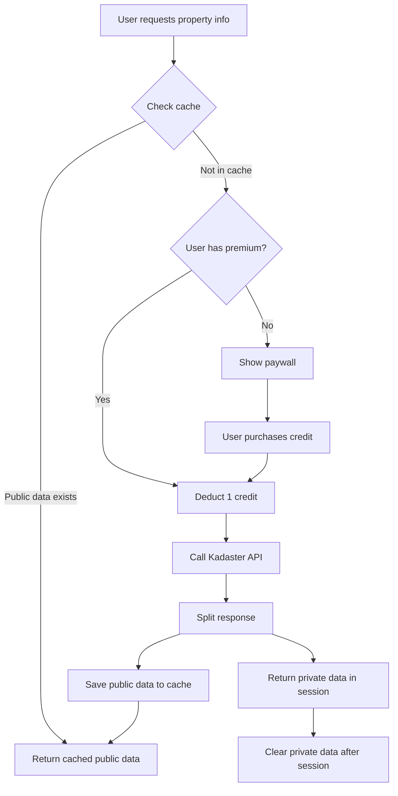

# Kadaster API Integration - Premium Feature Design

## Overview

This document outlines the GDPR-compliant architecture for integrating Kadaster property information as a premium feature, with clear separation between public and private data.

## What is Kadaster?

The **Kadaster** (Dutch Land Registry) is the official government organization that maintains the **BRK (Basisregistratie Kadaster)** - the basic registration of cadaster and property ownership in the Netherlands.

### Available Information

1. **Public Information** (can be cached and shared):
   - Property boundaries (cadastral parcels)
   - Surface area
   - Cadastral designation
   - Transaction year
   - Purchase price (koopsom) - **updated monthly around the 20th**
   - Property type

2. **Privacy-Sensitive Information** (one-time query only):
   - Current owner name(s)
   - Owner residential address
   - Mortgages and liens
   - Rights (erfpacht, right of use, etc.)
   - Legal restrictions

## Kadaster API Options

### 1. Official Kadaster APIs

#### BRK Bevragen API
- **Access**: Currently **only for government organizations** that are BSN authorized
- **Not available for commercial applications yet**
- **Pricing**: Not publicly disclosed

#### Objectinformatie API
- **Access**: Requires Mijn Kadaster account and API key
- **Pricing**: ~€0.45 per query for koopsom data
- **Data**: Address-based lookup for ownership, rights, and transaction information

#### Koopsom API
- **Access**: Request via Mijn Kadaster
- **Pricing**: €0.45 per query
- **Data**: Last transaction from BRK basic registration
- **Limitation**: Transaction history (past 5 years) requires separate queries

### 2. Third-Party Resellers

#### Webservices.nl - KadasterV2 API
- **Pricing**: ~€0.75 per API call
- **Access**: Easier signup, no Mijn Kadaster needed
- **Data**: Full cadastral extract including ownership and koopsom

#### Altum AI - Kadaster Transactie API
- **Pricing**: €0.75 per API call
- **Access**: Commercial API subscription
- **Data**: Transaction data and ownership information

### Recommendation
Start with **Webservices.nl** for ease of implementation, migrate to direct Kadaster API if volume justifies it.

## GDPR-Compliant Architecture

### Two-Tier Data Model

```
┌─────────────────────────────────────────────────────────────────┐
│                    PUBLIC DATA (Cacheable)                       │
├─────────────────────────────────────────────────────────────────┤
│ - Purchase price (koopsom)                                       │
│ - Transaction year                                               │
│ - Property boundaries (GeoJSON)                                  │
│ - Surface area (m²)                                              │
│ - Cadastral designation (Section X, Number Y)                   │
│ - Property type (house, apartment, land)                        │
│                                                                  │
│ Storage: PostgreSQL public table + cache                        │
│ Retention: Indefinite (public record)                           │
│ Sharing: All users can see once queried                         │
└─────────────────────────────────────────────────────────────────┘

┌─────────────────────────────────────────────────────────────────┐
│              PRIVATE DATA (One-time display only)                │
├─────────────────────────────────────────────────────────────────┤
│ - Owner name(s)                                                  │
│ - Owner address                                                  │
│ - Mortgage details                                               │
│ - Rights and restrictions (erfpacht details, etc.)              │
│ - Legal notations                                                │
│                                                                  │
│ Storage: NOT STORED - displayed once and discarded              │
│ Retention: Session only (cleared after user closes page)        │
│ Sharing: Only visible to user who paid for query                │
└─────────────────────────────────────────────────────────────────┘
```

### Database Schema

#### Public Table: `kadaster_public_data`
```sql
CREATE TABLE kadaster_public_data (
  id UUID PRIMARY KEY DEFAULT gen_random_uuid(),

  -- Property identification
  postal_code VARCHAR(6) NOT NULL,
  house_number INT NOT NULL,
  house_number_suffix VARCHAR(10),

  -- Public cadastral information
  cadastral_designation VARCHAR(50),  -- e.g., "Amsterdam, sectie AA, nummer 1234"
  surface_area_m2 DECIMAL(10, 2),
  property_type VARCHAR(50),  -- 'woonhuis', 'appartement', 'grond'

  -- Transaction information (PUBLIC RECORD)
  purchase_price_eur INT,  -- koopsom
  transaction_year INT,
  transaction_month INT,   -- for more precision

  -- Geometry
  boundary_geojson JSONB,  -- cadastral parcel boundary

  -- Metadata
  queried_at TIMESTAMP DEFAULT NOW(),
  api_source VARCHAR(50),  -- 'kadaster', 'webservices_nl', etc.
  last_updated TIMESTAMP DEFAULT NOW(),

  -- Indexing
  UNIQUE(postal_code, house_number, house_number_suffix)
);

CREATE INDEX idx_postal_code ON kadaster_public_data(postal_code);
CREATE INDEX idx_transaction_year ON kadaster_public_data(transaction_year);
```

#### Query Log Table: `kadaster_query_log` (for billing and analytics)
```sql
CREATE TABLE kadaster_query_log (
  id UUID PRIMARY KEY DEFAULT gen_random_uuid(),

  user_id UUID REFERENCES users(id),
  postal_code VARCHAR(6) NOT NULL,
  house_number INT NOT NULL,

  -- Query metadata
  query_type VARCHAR(20),  -- 'public_cached', 'full_paid'
  api_cost_eur DECIMAL(5, 2),  -- cost of API call if made
  was_cached BOOLEAN DEFAULT FALSE,

  -- Timestamps
  queried_at TIMESTAMP DEFAULT NOW(),

  -- GDPR: No private data stored here
  -- Only log that a query happened, not the result
);

CREATE INDEX idx_user_queries ON kadaster_query_log(user_id, queried_at);
```

### Query Flow



## API Implementation

### Backend Endpoint: `/api/kadaster/property`

```python
# backend/kadaster_service.py
import os
import httpx
from typing import Dict, Any, Tuple
from datetime import datetime

WEBSERVICES_NL_API_KEY = os.getenv("WEBSERVICES_NL_API_KEY")
WEBSERVICES_NL_BASE_URL = "https://ws1.webservices.nl/rpc/json"

async def query_kadaster(
    postal_code: str,
    house_number: int,
    house_number_suffix: str = ""
) -> Tuple[Dict[str, Any], Dict[str, Any]]:
    """
    Query Kadaster via Webservices.nl API.

    Returns:
        Tuple of (public_data, private_data)
    """

    headers = {
        "Content-Type": "application/json"
    }

    payload = {
        "jsonrpc": "2.0",
        "method": "kadasterV2GetObject",
        "params": {
            "apikey": WEBSERVICES_NL_API_KEY,
            "postcode": postal_code,
            "huisnummer": house_number,
            "toevoeging": house_number_suffix
        },
        "id": 1
    }

    async with httpx.AsyncClient(timeout=30.0) as client:
        response = await client.post(WEBSERVICES_NL_BASE_URL, json=payload, headers=headers)
        response.raise_for_status()
        data = response.json()

    result = data.get("result", {})

    # Split into public and private data
    public_data = {
        "postal_code": postal_code,
        "house_number": house_number,
        "house_number_suffix": house_number_suffix,
        "cadastral_designation": result.get("kadastraalaanduiding"),
        "surface_area_m2": result.get("oppervlakte"),
        "property_type": result.get("soortObject"),
        "purchase_price_eur": result.get("koopsom"),
        "transaction_year": result.get("transactieJaar"),
        "transaction_month": result.get("transactieMaand"),
        "boundary_geojson": result.get("perceelgrens"),  # GeoJSON polygon
        "api_source": "webservices_nl",
        "queried_at": datetime.now().isoformat()
    }

    # Private data - NEVER stored in database
    private_data = {
        "owner_names": result.get("eigenaren", []),  # List of owner names
        "owner_address": result.get("eigenaarAdres"),
        "mortgages": result.get("hypotheken", []),
        "rights": result.get("rechten", []),  # erfpacht, etc.
        "legal_restrictions": result.get("beperkingen", [])
    }

    return public_data, private_data
```

### FastAPI Endpoint

```python
# backend/api_server.py
from fastapi import FastAPI, HTTPException, Depends
from typing import Optional
import polars as pl
from pathlib import Path

@app.post("/api/kadaster/property")
async def get_kadaster_property(
    postal_code: str,
    house_number: int,
    house_number_suffix: Optional[str] = "",
    user_id: Optional[str] = None,  # From auth token
    include_private: bool = False
):
    """
    Get Kadaster property information.

    - Public data is cached and free for all users
    - Private data requires premium subscription
    """

    # Check cache first (public data)
    cached_public = get_cached_public_data(postal_code, house_number, house_number_suffix)

    if cached_public and not include_private:
        return {
            "success": True,
            "data": cached_public,
            "cached": True,
            "cost": 0
        }

    # User wants private data or no cache exists
    if include_private or not cached_public:
        # Verify user has premium subscription
        if not user_id:
            raise HTTPException(status_code=401, detail="Authentication required")

        user_credits = check_user_credits(user_id)
        if user_credits < 1:
            raise HTTPException(
                status_code=402,
                detail="Insufficient credits. Purchase more to access Kadaster data."
            )

        # Deduct credit
        deduct_user_credit(user_id, cost=0.75)  # €0.75 per query

        # Query Kadaster API
        try:
            public_data, private_data = await query_kadaster(
                postal_code, house_number, house_number_suffix
            )
        except Exception as e:
            # Refund credit if API fails
            refund_user_credit(user_id, 0.75)
            raise HTTPException(status_code=503, detail=f"Kadaster API error: {e}")

        # Save public data to cache for everyone
        save_public_data_to_cache(public_data)

        # Log query (for billing and analytics)
        log_kadaster_query(
            user_id=user_id,
            postal_code=postal_code,
            house_number=house_number,
            query_type="full_paid",
            api_cost_eur=0.75,
            was_cached=False
        )

        response = {
            "success": True,
            "public_data": public_data,
            "cached": False,
            "cost": 0.75
        }

        # Only include private data if requested
        if include_private:
            response["private_data"] = private_data
            response["privacy_notice"] = (
                "This private information is shown once and not stored. "
                "Please save it if needed as it will not be accessible again without another query."
            )

        return response

    # Return cached public data
    return {
        "success": True,
        "data": cached_public,
        "cached": True,
        "cost": 0
    }


def save_public_data_to_cache(public_data: dict):
    """Save public data to PostgreSQL cache."""
    # Implementation using your DB library (Polars, SQLAlchemy, etc.)
    pass


def get_cached_public_data(postal_code: str, house_number: int, suffix: str):
    """Retrieve cached public data."""
    # Query PostgreSQL
    pass
```

## Frontend Implementation

### Premium Feature UI

```typescript
// frontend/src/components/KadasterInfo.tsx
'use client'

import { useState } from 'react'
import { Lock, Info, CheckCircle } from 'lucide-react'

interface KadasterInfoProps {
  postalCode: string
  houseNumber: number
  suffix?: string
}

export function KadasterInfo({ postalCode, houseNumber, suffix }: KadasterInfoProps) {
  const [publicData, setPublicData] = useState(null)
  const [privateData, setPrivateData] = useState(null)
  const [loading, setLoading] = useState(false)
  const [showPaywall, setShowPaywall] = useState(false)

  const loadPublicData = async () => {
    setLoading(true)
    try {
      const response = await fetch('/api/kadaster/property?' + new URLSearchParams({
        postal_code: postalCode,
        house_number: houseNumber.toString(),
        house_number_suffix: suffix || ''
      }))

      const data = await response.json()

      if (data.cached) {
        setPublicData(data.data)
      } else if (response.status === 402) {
        setShowPaywall(true)
      }
    } catch (error) {
      console.error('Error loading Kadaster data:', error)
    } finally {
      setLoading(false)
    }
  }

  const loadFullData = async () => {
    setLoading(true)
    try {
      const response = await fetch('/api/kadaster/property', {
        method: 'POST',
        headers: { 'Content-Type': 'application/json' },
        body: JSON.stringify({
          postal_code: postalCode,
          house_number: houseNumber,
          house_number_suffix: suffix || '',
          include_private: true
        })
      })

      const data = await response.json()

      setPublicData(data.public_data)
      setPrivateData(data.private_data)

      // Clear private data after 5 minutes for security
      setTimeout(() => {
        setPrivateData(null)
      }, 5 * 60 * 1000)
    } catch (error) {
      console.error('Error loading full Kadaster data:', error)
    } finally {
      setLoading(false)
    }
  }

  return (
    <div className="bg-white border border-gray-200 rounded-lg p-4 shadow-sm">
      <div className="flex items-center justify-between mb-3">
        <h3 className="font-semibold text-gray-900">Property Ownership (Kadaster)</h3>
        <Info className="w-4 h-4 text-gray-400" />
      </div>

      {/* Public Data (Free, Cached) */}
      {publicData && (
        <div className="space-y-2 text-sm mb-4">
          <div className="flex justify-between">
            <span className="text-gray-600">Purchase Price:</span>
            <span className="font-semibold text-gray-900">
              € {publicData.purchase_price_eur?.toLocaleString('nl-NL')}
            </span>
          </div>
          <div className="flex justify-between">
            <span className="text-gray-600">Transaction Year:</span>
            <span className="font-semibold text-gray-900">{publicData.transaction_year}</span>
          </div>
          <div className="flex justify-between">
            <span className="text-gray-600">Surface Area:</span>
            <span className="font-semibold text-gray-900">{publicData.surface_area_m2} m²</span>
          </div>
          <div className="flex justify-between">
            <span className="text-gray-600">Cadastral ID:</span>
            <span className="font-semibold text-gray-900 text-xs">{publicData.cadastral_designation}</span>
          </div>
        </div>
      )}

      {/* Private Data (Premium Only) */}
      {privateData && (
        <div className="bg-blue-50 border border-blue-200 rounded p-3 mb-4">
          <div className="text-xs text-blue-700 mb-2 font-medium flex items-center gap-1">
            <Lock className="w-3 h-3" />
            Private Information (Not Stored)
          </div>
          <div className="space-y-2 text-sm">
            {privateData.owner_names && (
              <div>
                <span className="text-gray-600">Owner(s):</span>
                <div className="font-semibold text-gray-900">
                  {privateData.owner_names.join(', ')}
                </div>
              </div>
            )}
            {privateData.rights && privateData.rights.length > 0 && (
              <div>
                <span className="text-gray-600">Rights:</span>
                <ul className="list-disc list-inside text-gray-900">
                  {privateData.rights.map((right, i) => (
                    <li key={i}>{right}</li>
                  ))}
                </ul>
              </div>
            )}
          </div>
          <div className="text-xs text-blue-600 mt-2">
            This information will disappear in 5 minutes. Save it if needed.
          </div>
        </div>
      )}

      {/* Call to Action */}
      {!publicData && (
        <button
          onClick={loadPublicData}
          disabled={loading}
          className="w-full py-2 px-4 bg-gray-100 text-gray-700 rounded-md text-sm font-medium hover:bg-gray-200 transition-colors"
        >
          {loading ? 'Loading...' : 'View Property Info (Free)'}
        </button>
      )}

      {publicData && !privateData && (
        <button
          onClick={loadFullData}
          disabled={loading}
          className="w-full py-2 px-4 bg-blue-600 text-white rounded-md text-sm font-medium hover:bg-blue-700 transition-colors flex items-center justify-center gap-2"
        >
          <Lock className="w-4 h-4" />
          {loading ? 'Loading...' : 'View Full Report (€0.75)'}
        </button>
      )}

      {showPaywall && (
        <div className="bg-yellow-50 border border-yellow-200 rounded p-3 text-sm">
          <p className="text-yellow-800 font-medium mb-2">Premium Feature</p>
          <p className="text-yellow-700 text-xs mb-3">
            Kadaster property ownership data requires credits.
          </p>
          <button className="w-full py-2 px-4 bg-yellow-600 text-white rounded-md text-sm font-medium hover:bg-yellow-700">
            Purchase Credits
          </button>
        </div>
      )}
    </div>
  )
}
```

## Pricing Model

### Credit System
- **1 credit = €1.00**
- **Kadaster query costs 1 credit** (covers €0.75 API cost + €0.25 profit)

### Pricing Tiers
```
┌─────────────────────────────────────────────────┐
│           Starter Pack - €5                     │
├─────────────────────────────────────────────────┤
│ 5 Kadaster queries                              │
│ €1.00 per query                                 │
└─────────────────────────────────────────────────┘

┌─────────────────────────────────────────────────┐
│           Premium Pack - €20 (20% discount)     │
├─────────────────────────────────────────────────┤
│ 25 Kadaster queries                             │
│ €0.80 per query                                 │
└─────────────────────────────────────────────────┘

┌─────────────────────────────────────────────────┐
│          Professional - €50 (33% discount)      │
├─────────────────────────────────────────────────┤
│ 75 Kadaster queries                             │
│ €0.67 per query                                 │
└─────────────────────────────────────────────────┘
```

## GDPR Compliance Checklist

### ✅ Legal Basis
- [x] Data processing based on legitimate interest (Article 6(1)(f) GDPR)
- [x] Public cadastral data can be processed and cached (public record)
- [x] Private data only shown to requesting user (minimization principle)

### ✅ Data Minimization
- [x] Only query Kadaster when user explicitly requests
- [x] Store only public information
- [x] Never log private data (owner names, addresses)

### ✅ Purpose Limitation
- [x] Public data: Provide property market intelligence
- [x] Private data: One-time display for due diligence purposes

### ✅ Transparency
- [x] Clear notice before query: "This will cost 1 credit"
- [x] Privacy notice: "Private data shown once, not stored"
- [x] Data source attribution: "Data from Kadaster via Webservices.nl"

### ✅ User Rights
- [x] Right to access: Users can see their query history
- [x] Right to deletion: Delete query log entries (not public cache)
- [x] Right to data portability: Export query history as JSON/CSV

### ✅ Security
- [x] API keys stored in environment variables
- [x] Private data never written to disk
- [x] Private data cleared from memory after session
- [x] HTTPS only for API calls

### ✅ Accountability
- [x] Query logging (who, when, what - but not results)
- [x] Audit trail for billing
- [x] No retention of private data (by design)

## Implementation Timeline

### Phase 1: Basic Integration (Week 1-2)
- [ ] Set up Webservices.nl account and API key
- [ ] Implement `query_kadaster()` function
- [ ] Create PostgreSQL public data cache
- [ ] Build `/api/kadaster/property` endpoint
- [ ] Test with sample queries

### Phase 2: Frontend (Week 3)
- [ ] Create `KadasterInfo` component
- [ ] Add credit system UI
- [ ] Implement paywall for premium features
- [ ] Add privacy notices and disclaimers

### Phase 3: Billing (Week 4)
- [ ] Integrate payment processor (Stripe)
- [ ] Implement credit purchase flow
- [ ] Build user dashboard for credits
- [ ] Add query history page

### Phase 4: Polish (Week 5-6)
- [ ] Add error handling and retries
- [ ] Implement refund logic for failed queries
- [ ] Create admin panel for monitoring
- [ ] Write user documentation
- [ ] Legal review of terms

## Alternative: Community Cost-Sharing Model

Instead of per-query pricing, consider:

**Community Pool Model**
- All premium users pay €10/month
- Pool covers Kadaster API costs
- Fair use policy: max 20 queries/month per user
- Excess queries shared across all subscribers
- Lower barrier to entry, predictable costs

Example:
- 100 users × €10/month = €1,000/month revenue
- Kadaster cost: €0.75/query
- Break-even at ~1,333 queries/month (13 per user average)
- Profit margin if usage stays reasonable

## Conclusion

This architecture ensures:
1. **GDPR compliance** through clear separation of public/private data
2. **Cost efficiency** through caching of public information
3. **User privacy** by never storing sensitive owner information
4. **Transparency** with clear pricing and data usage notices
5. **Sustainability** with profitable premium feature

The key innovation is **treating purchase price (koopsom) as public data** (which it legally is) and caching it for all users, while keeping owner names and private details ephemeral.
